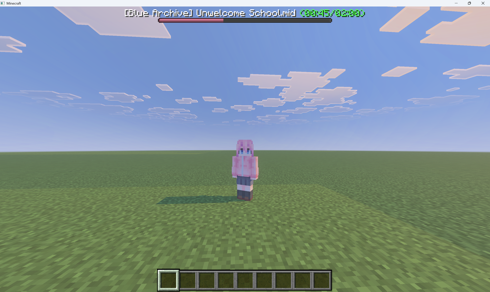

# NBSAllay

Note block song player for Allay server

## Prerequisites

- Java21 or higher.
- Allay installed.

## Usage
 
Command: `/nbs` (require `nbsa.command` permission)

- `/nbs play`: Choose and play a song.
- `/nbs pause`: Pause playing.
- `/nbs resume`: Resume playing.
- `/nbs stop`: Stop playing.
- `/nbs reload`: Reload songs.

## License

This project is licensed under the MIT License - see the [LICENSE](LICENSE) file for details.